# 星巴克用户分析项目
## 项目概述
## 简介和目的
这个数据集是一些模拟 Starbucks rewards 移动 app 上用户行为的数据。每隔几天，星巴克会向 app 的用户发送一些推送。这个推送可能仅仅是一条饮品的广告或者是折扣券或 BOGO（买一送一）。一些顾客可能一连几周都收不到任何推送。

我的目的是将交易数据、人口统计数据和推送数据结合起来判断哪一类人群会受到某种推送的影响。

## 所用数据集
数据集是从星巴克 app 的真实数据简化而来，一共有三个数据文件：

* portfolio.json – 包括推送的 id 和每个推送的元数据（持续时间、种类等等）
* profile.json – 每个顾客的人口统计数据
* transcript.json – 交易、收到的推送、查看的推送和完成的推送的记录
以下是文件中每个变量的类型和解释 ：

**portfolio.json**

* id (string) – 推送的id
* offer_type (string) – 推送的种类，例如 BOGO、打折（discount）、信息（informational）
* difficulty (int) – 满足推送的要求所需的最少花费
* reward (int) – 满足推送的要求后给与的优惠
* duration (int) – 推送持续的时间，单位是天
* channels (字符串列表)

**profile.json**

* age (int) – 顾客的年龄
* became_member_on (int) – 该顾客第一次注册app的时间
* gender (str) – 顾客的性别（注意除了表示男性的 M 和表示女性的 F 之外，还有表示其他的 O）
* id (str) – 顾客id
* income (float) – 顾客的收入

**transcript.json**

* event (str) – 记录的描述（比如交易记录、推送已收到、推送已阅）
* person (str) – 顾客id
* time (int) – 单位是小时，测试开始时计时。该数据从时间点 t=0 开始
* value - (dict of strings) – 推送的id 或者交易的数额

## 问题定义
星巴克拥有成千上万的顾客，有不同的消费行为和偏好。为了提供更精准和有效的推送策略，我们需要想办法将顾客分成不同的群体。

## 评价指标
因为用到非监督机器学习方法，我会用到elbow和silhouette coefficient来评判聚类算法的效果，和得到最优的分类数量。

## 数据清洗
1. 对收入空的记录用平均收入来填充，增加1个字段记录收入是否为空
2. 增加1个字段，记录顾客成为会员的年份
3. 用MultiLabelBinarizer方法对推送渠道拆分成，并用独热编码创建字段
4. 对推送类型、性别、注册年份和记录描述进行独热编码
5. 移除特异值（如年龄99以上）
6. 处理初次收到、打开、消费的时间，因推送可以被重复发送与记录
7. 移除接受推送的错误判定
8. 增加RFM模型中的最近消费时间、消费频率和消费金额
9. 计算各种推送种类的打开率和转化率
10. 合并数据，以顾客为单位分组，并增加每种推送类型的平均消费次数

## 探索性数据分析
此数据集约有30万个消费记录、1.7万顾客信息和10种推送记录。
大部分的顾客都是男性。
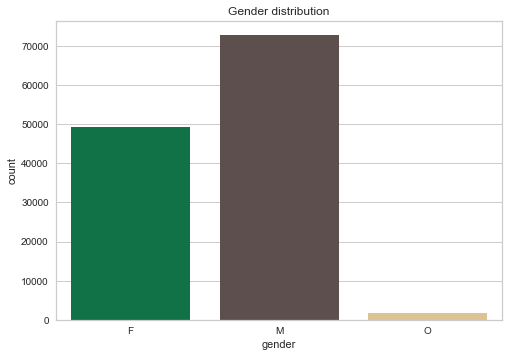

移除特意值后，平均年龄是53岁，男顾客的平均年龄比女顾客小。

收入的范围从3万到12万美元，均值61800，女顾客的平均收入更高，可能跟平均年龄大相关。

平均消费金额只有14美元，但有长尾的现象，最高消费金额为1062美元。
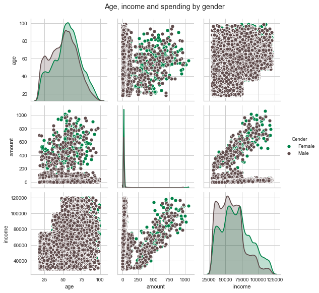

“买一送一”的推送有更高的打开率，但转化率比折扣券低。
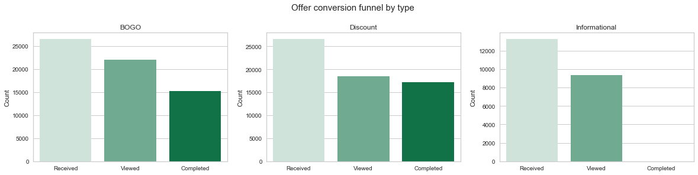

## 聚类分析
### 1. 特征缩放
利用StandardScaler来进行特征缩放，使各维度特征缩放到均值0，标准差1。

### 2. 降维
因k-means的算法适用与特征数量较小的情况，故适用PCA来进行将特征量降维到12个。
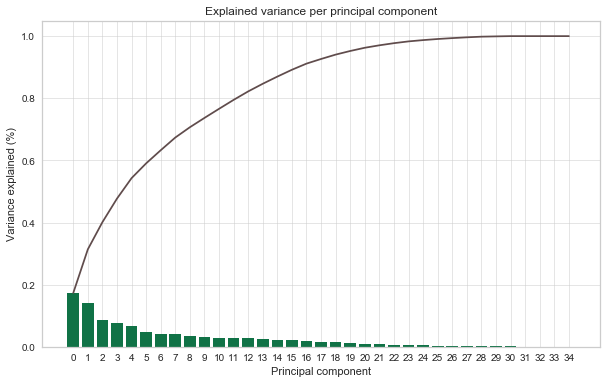

### 3. 聚类分析
用k-means方法给数据分类，用elbow方法和silhouette分数得到4个聚类。
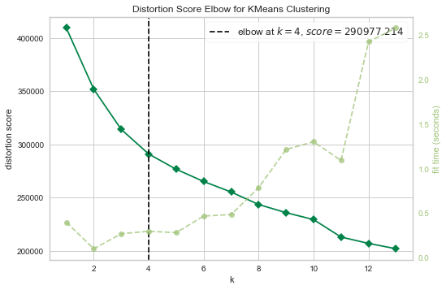
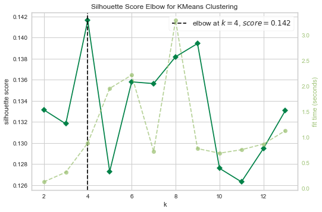
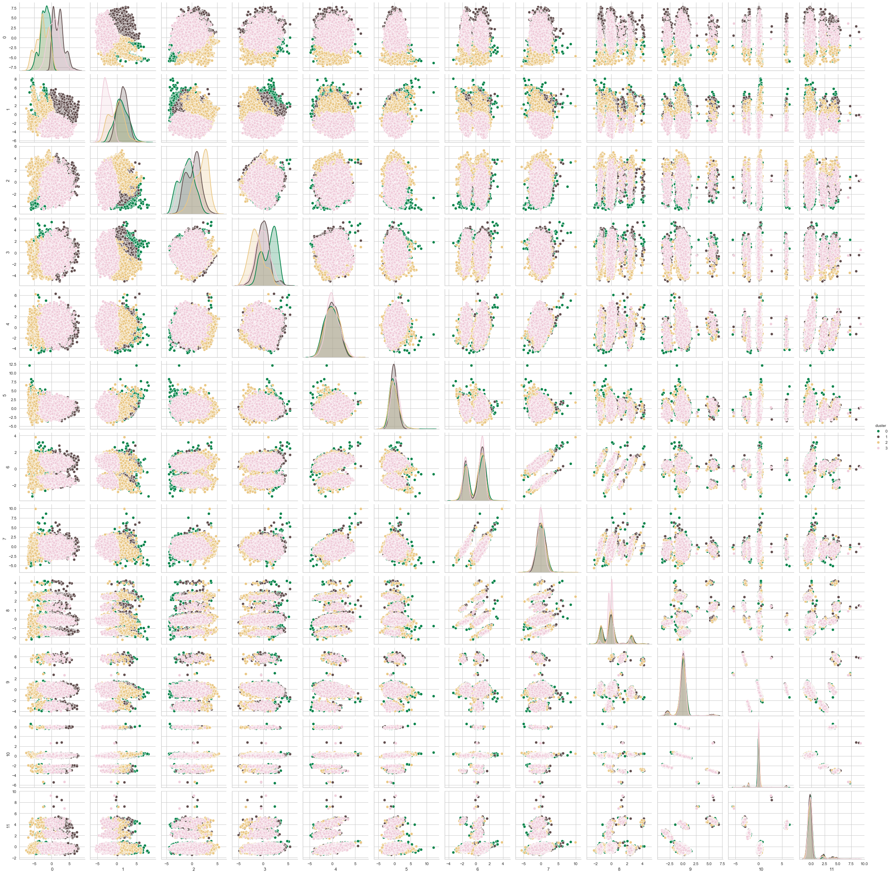

之后也尝试用DBSCAN和OPTICS两种聚类方法，
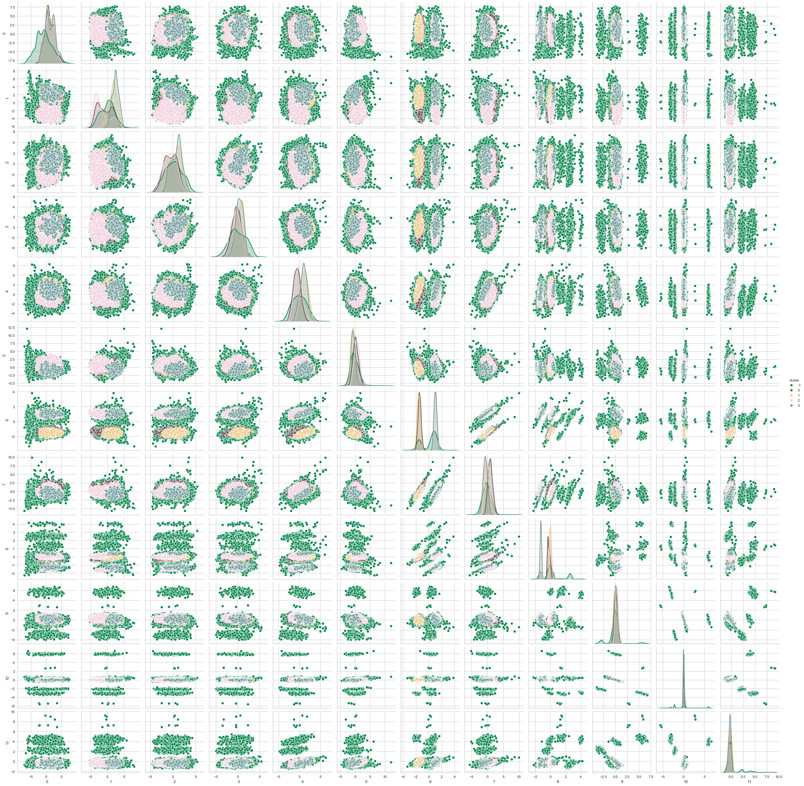
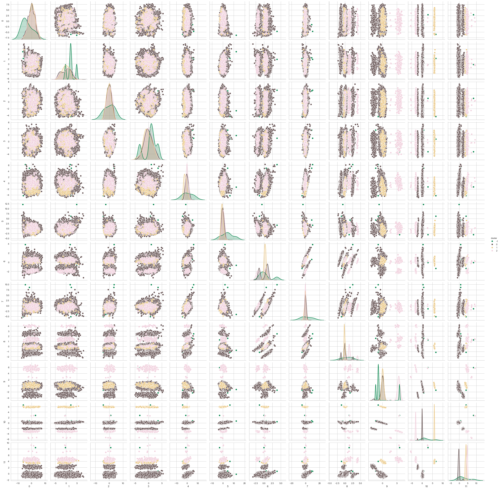

## 模型评价与改进
尽管DBSCNAN和OPTICS的聚类方法表现更好，但它们更强调性别与注册年份的差异，而对打开率和转化率的差异不明显，所以对调整实际营销策略的意义不是很大。
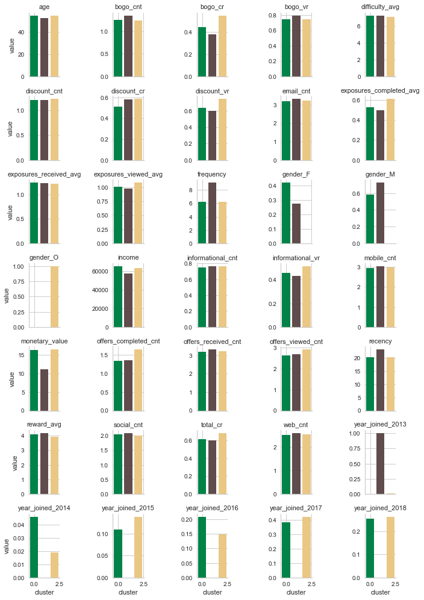

k-means的分类结果在打开率和转化率的差异明显，这对营销策略的调整更有指导意义，所以最后选择k-means的分类方法。
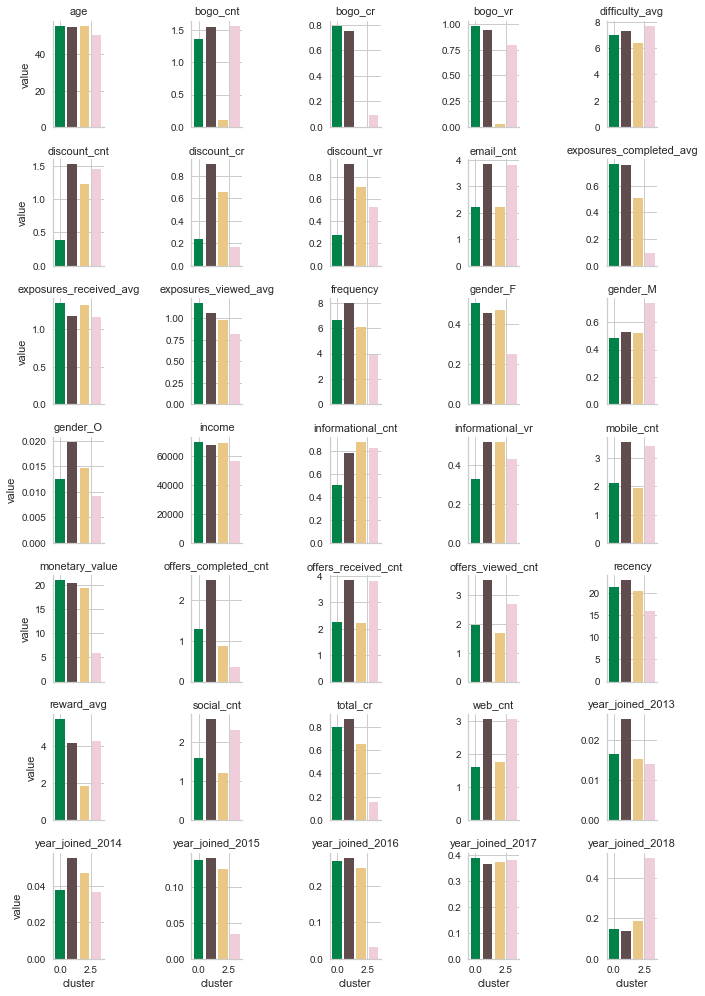

## 结果讨论
对此我们可以有以下结论：
### 群体1
此顾客群体收到了一定量的“买一送一”推送，基本很少打折推送。因此这些“买一送一”的推送让此群体得到的优惠是4个顾客群体中最多的。

他们的消费频率和消费金额高于平均水平，因此**建议对此群体的顾客继续定期地发“买一送一”的推送**，因为此群体的顾客从打开率和转化率都很高。

### 群体2
此顾客群体收到最多的推送，其中“买一送一”和折扣券的转化率都很好，而且性别是其他的人数比其他群体都多。

他们的消费金额和消费频率高于平均水平，可能得益于大量的推送广告，建议**继续定期发送“买一送一”和折扣券**来刺激他们消费。

### 群体3
此顾客群体收到很少的“买一送一”推送，折扣券也较少，普通广告的数量是中等水平。

但他们的消费频率和金额能保持在一定水平，对推送广告不太敏感，所以建议**停止对他们推送**。

### 群体4
此顾客群体定期收到推送广告，在打开率正常的情况下，虽然转化率很低。

他们大部分都是男性，收入也低于平均值，消费频率和金额也较低。所以建议**停止对他们推送**，因为他们并非主要的消费人群。

## 总结
### 反思
1. 在这个项目中，我们需要花费大量的时间，约80%的工作量来清理数据，虽然很挑战但也是值得的，因为这是数据科学中的基础工作，在处理数据的同时我们也更深地理解数据的规律和涉及的业务信息。

2. 项目的成果是通过聚类方法将顾客分成4个群体，并相应地调整推送策略，这很有实际意义，能对业务方提供具体的指导建议。

### 改进
1. 数据集中存在一些脏数据，例如重复的消费数据，顾客信息的缺失，如果将来能在数据源的收集上尽量做好完备和修复漏洞，这些更准确的数据将会带来更准确的分类或预测。

2. 在填充收入的缺失数据时我用了收入均值来填充，这看起来有点过于直接，可能会影响模型效果。改进方法可以用有监督的机器学习方法，会得到更准确的数据来填充。